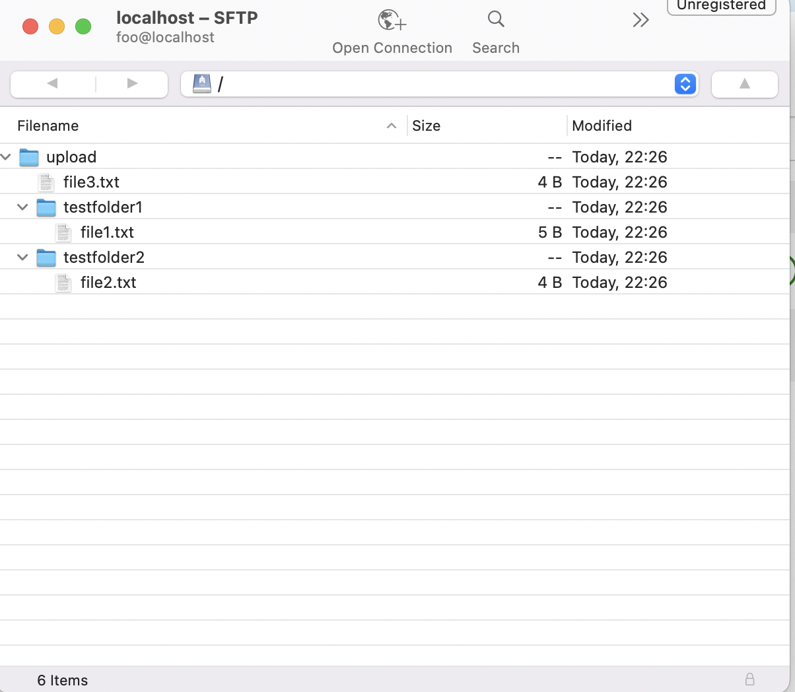

## Flow Design


## Setup 

```
	Install Docker vs Docker Compose
```
## How To Run

**Setup Env Var:**
```
	export AIRFLOW_UID=50000
```
**Build docker with docker-compose**
```
	docker-compose build
```
**Run docker**
```
	docker-compose up
```
**Config Airlfow connection for SFTP Server A vs B**

| SFTP Server | connection id |  Host   | Port | User name  | Password  | Connection Type|
|-------------|---------------|---------|------|------------|-----------|----------------|
| `a`         | `sftp_a_conn` | `sftp_a`| 22   | `foo`      | `pass`    |     SFTP		 | 
| `b`         | `sftp_b_conn` | `sftp_b`| 22   | `foo`		| `pass`    |	  SFTP       |


**Create data At SFTP Server A:**


**View Home Page**


| Variable            | Default value |  Role                |
|---------------------|---------------|----------------------|
| `ARIFLOW USER`      | `airflow`     | admin 				 |
| `ARIFLOW_PASS`      | `airflow`     | admin				 |

**Run Dag**

**Result**





